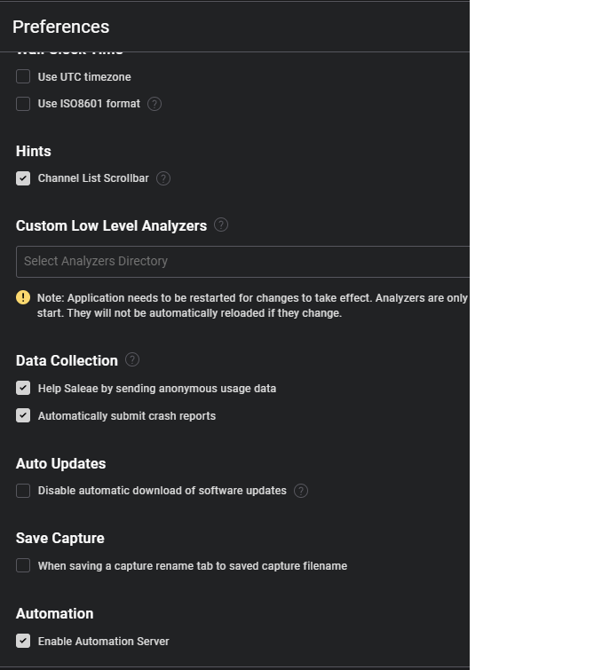

# Combined-Environment-Control-Interface

# Installation of Docker 
1. Download the docker program from the offical docker webpage ```https://docs.docker.com/engine/install/```
2. Restart your computer to finish installation

# Download Repository and run the powershell scripts 
2. Clone/download this repository
4. Open a powershell with admin right on the folder where the repository was cloned (accept the prompt to open admin acces)
5. Go to the folder python-image
6. Give the installation batch access to run with admin rights by running on the command line
```{ Set-ExecutionPolicy Bypass -Scope Process }```
10. Enables Saleae's software Logic for automation by selecting preferences and ticking the automatin checkmark as shown
   

   

# Windows Driver and Program Setup 
1. Once in the folder Combined-Environment-Control-Interface\python-image run the powershell commands ``` ./install_all.ps1 ```

If you get the error:
```
{\install_all.ps1 cannot be loaded 
because running scripts is disabled on this system. For more information, see about_Execution_Policies at https:/go.microsoft.com/fwlink/?LinkID=135170.
At line:1 char:1
+ .\install_all.ps1
+ ~~~~~~~~~~~~~~~~~
    + CategoryInfo          : SecurityError: (:) [], PSSecurityException
    + FullyQualifiedErrorId : UnauthorizedAccess
}
```
you may be attempting to run the installation without admin rights. Please refer to step #4 of _Installation Process_

2. Follow the installation wizard to install logic 
3. You should see ``` Driver Setup.exe executed successfully.``` appear on the console

# Bulid the Python Developer Setup 
1. You will only need to build a docker image once. To do so open powershell with administrator rights
2. Open docker program on you computer
3. Change your directory to where **Combined-Environment-Control-Interface** -> **Python-Image**
4. To build the image from the docker file run ``` docker build -t ceci_image .``` In this example we tagged(named) the image as ceci_image
5. Take a coffee brake might take 5-10 minutes
6. Make sure Xming is running to ensure the GUI interface
7. Run the docker image as a container by running on the powershell

```
docker run -t -i --privileged -v /dev/bus/usb:/dev/bus/usb -v $HOME/Desktop:/mnt/desktop ceci_image bash

```
```
work on the mnt: /mnt/desktop
```
```
and on the json file and folder name directories

```
echo $env:USERPROFILE\Desktop
```
```
docker run -t -i --privileged -v /dev/bus/usb:/dev/bus/usb image bash
```
```
docker run -t -i --privileged -v /dev/bus/usb:/dev/bus/usb -v $HOME/Desktop:/mnt/desktop image bash
```


